<div align="center">

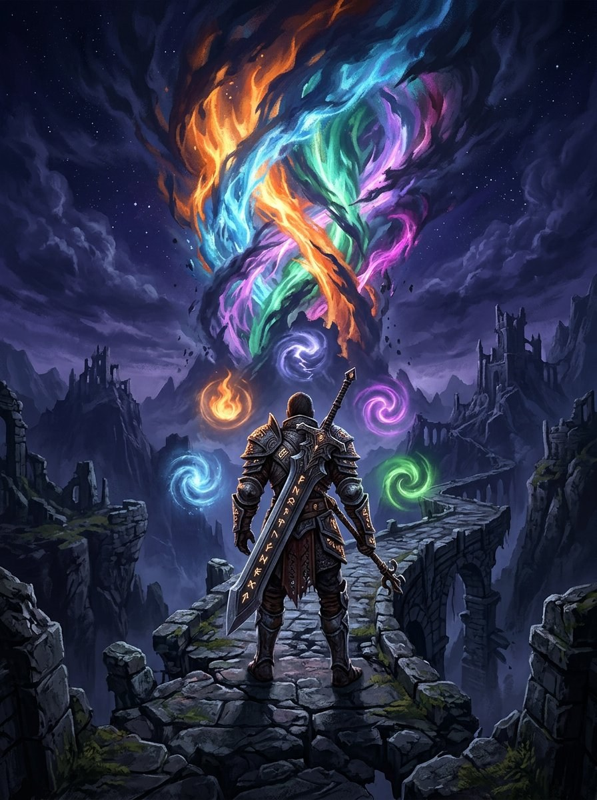

# ⚔️ ChronicleRift

**A real-time 3D fighting RPG that lives inside Telegram — five elemental heroes, five monsters, loot, relics and an AI-narrated world.**

[](https://github.com/iamrita-ai/chronicle-rift/actions/workflows/ci.yml)
[](https://www.python.org/)
[](https://core.telegram.org/bots/api)
[](https://threejs.org/)
[](https://fastapi.tiangolo.com/)
[](LICENSE)
[](https://github.com/iamrita-ai/chronicle-rift/stargazers)
[](CONTRIBUTING.md)

[▶ Play](#-play) · [🎮 Gameplay](#-gameplay) · [🚀 Deploy your own](#-deploy-your-own) · [🤝 Contribute](#-contributing) · [🔐 Security](#-security)

</div>

---

## 🎬 See it in motion

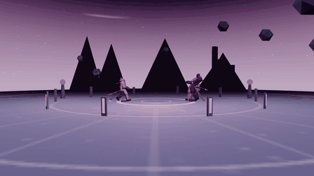

*[▶ Download the full-quality gameplay video (MP4)](docs/assets/demo.mp4)* · captured straight from the live engine with `tools/capture_demo.py`

---

## ✨ What's inside

| | |
| --- | --- |
| 🥊 **Real-time 3D combat** | A Three.js arena — fully jointed fighters, real weapon swings, hitboxes that only land when the blade connects, knockback arcs, hit-stop, slow-motion K.O.s and impact zoom. |
| 🧙 **Five hand-built heroes** | Emberblade (flaming sword), Frostward (ice spear + tower shield), Stormcaller (twin sabers on the gale), the Rift Reader (rift-tome + orbiting runes), Voidreaper (hooded scythe). |
| 👹 **Five distinct monsters** | The quadruped Rift Stalker with a live tail, the hulking Ash Warden, shard-orbiting Obsidian Herald, floating Frost Revenant and the boss Ebon Colossus. |
| 🌍 **Living arenas** | Painted sky domes, rune pillars, floating rift rocks, flickering braziers and drifting elemental motes — themed per element. |
| ⚡ **Smooth by design** | Fixed 120 Hz simulation, buffered inputs, adaptive resolution that protects frame rate on weak phones — plus a **Graphics** setting (Auto / 3D / 2D) so any device can force the always-works 2D engine. |
| 🛍 **Economy that matters** | Coins, loot chests, 18 items, upgradeable relics, a marketplace and a hero roster — the shop shows each ability's **damage and effects**, not just timers. |
| 🤖 **Colored bot home** | Every button on `/start` is colored and deep-links straight into the matching Mini App screen: play, store, satchel, heroes, profile, rules, terms — plus **Share** and **GitHub**. |
| 💬 **Feedback pipeline** | One red button collects bug reports, feature requests and ideas — every note is stored **and delivered to the owner's Telegram**. |
| 👑 **Owner test mode** | Set `OWNER_USER_ID` and the owner account plays with every hero, relic and a full purse — everything unlocked for testing. |
| 🧠 **AI narration — now spoken** | Groq flavors each chapter with a short narrative, and Orpheus TTS reads the latest chapter aloud from the 🔊 button on the quest card. Combat math stays deterministic and server-side. |
| 🔐 **Hardened by default** | Telegram `initData` HMAC validation, webhook secret checks, strict CSP, optimistic concurrency in MongoDB. |

## 📸 Screenshots

| Rift Arena — elemental duels | |
| :---: | :---: |
| 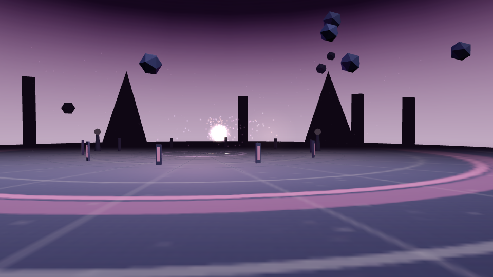 | 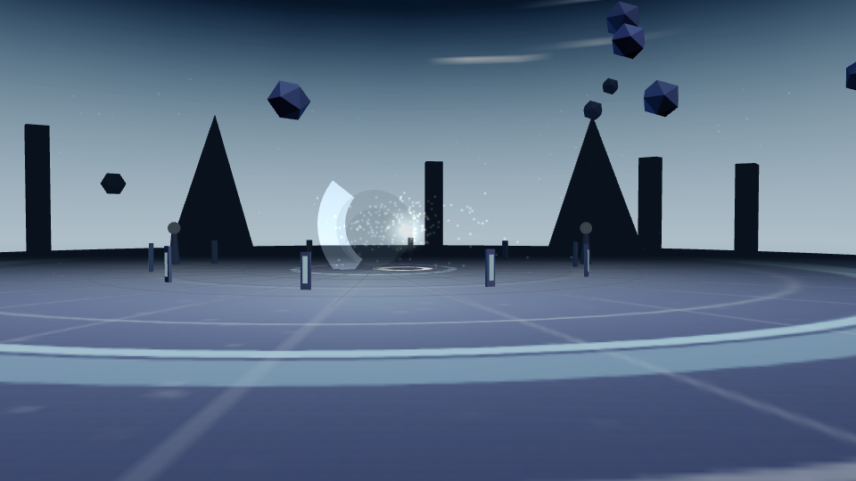 |
| 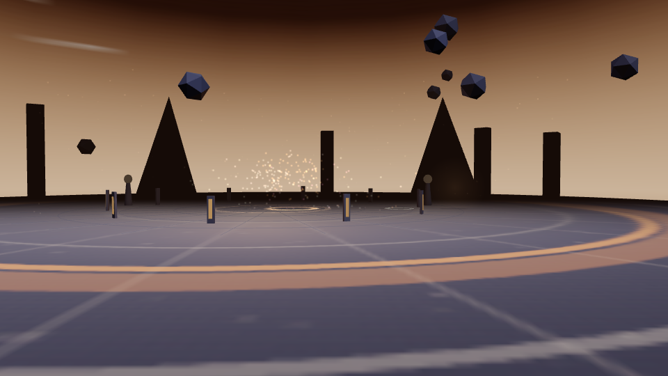 | 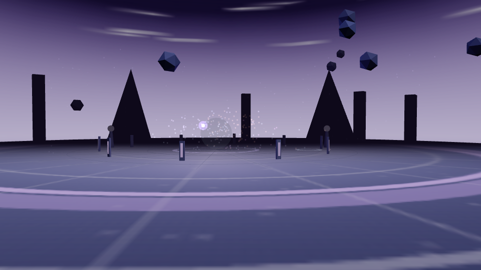 |
| 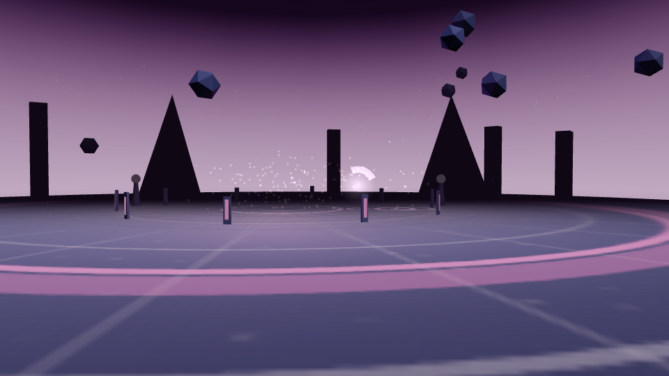 | 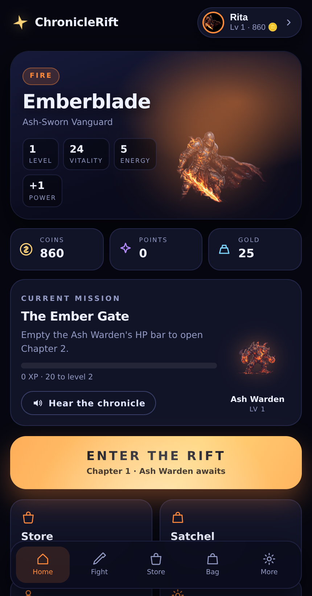 |
| 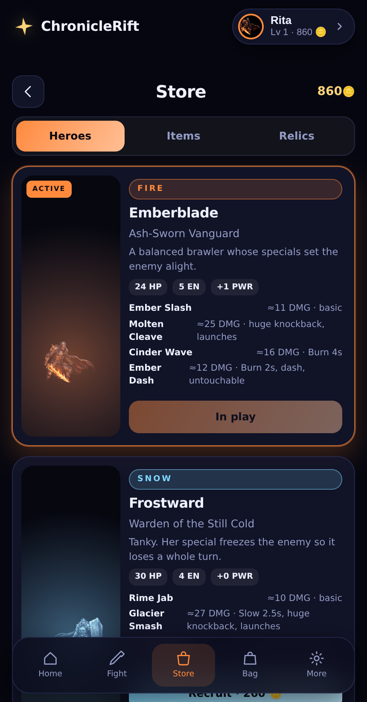 | 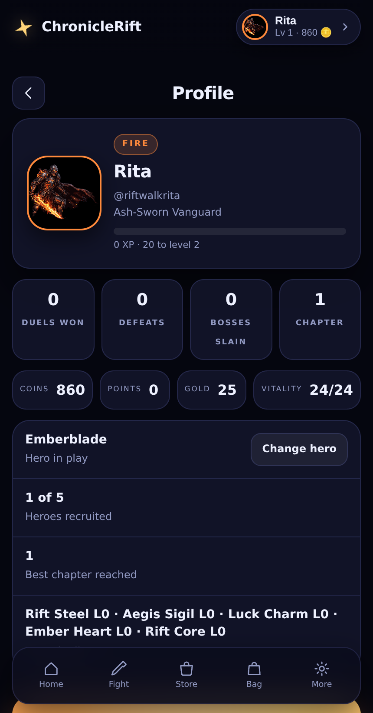 |
| 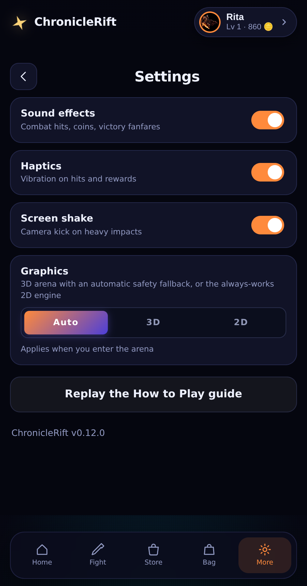 | |

## 🎮 Gameplay

You are a Riftwalker. One monster guards each chapter — empty its HP bar in a **real-time duel** to clear it, earn Gold, Coins, Points and a loot chest, and a stronger monster steps up. Every 5th chapter is a boss with doubled rewards. Death is safe: you wake at camp fully healed and keep everything.

**Controls** — joystick to move, the big sword button to attack, three ability buttons above it. Tap during a recovery and the input is buffered into the next swing. Desktop: `A`/`D` move, `J`/`Space` attack, `U`/`I`/`O` for abilities.

**The five hero kits** (the shop shows live damage estimates for your level):

| Hero | Element | Signature abilities |
| --- | --- | --- |
| ⚔️ Emberblade | 🔥 Fire | Molten Cleave (huge knockback) · Cinder Wave (burn) · Ember Dash (untouchable) |
| 🛡 Frostward | ❄️ Snow | Glacier Smash (slows) · Deep Freeze (freezes solid) · Frost Barrier (−55% damage) |
| 🌪 Stormcaller | 🌬 Wind | Cyclone Kick (3 hits) · Gale Flurry (3 gusts) · Blink (teleport + haste) |
| 🔮 Rift Reader | ✨ Magic | Sigil Burst · Mind Siphon (unblockable, heals 50%) · Rune Ward (+stamina) |
| 💀 Voidreaper | 🌑 Shadow | Grave Arc · Soul Harvest (drains + slows) · Shadowstep (empowered next hit) |

**Rules, terms and fairness** — the full [Rules & Regulations](src/chronicle_rift/game_engine.py) and Terms & Conditions are one tap away in the bot menu and inside the Mini App. One account per player; automation and spoofed identities cost access.

## ▶ Play

1. Open the bot in a private Telegram chat and press **▶️ PLAY — RIFT ARENA**.
2. The Mini App opens full-screen: home hub, store, satchel, heroes, profile, rules and terms.
3. Share the game with **📢 Share Game** — it hands out the direct `t.me/<bot>/app` Mini App link.

> Deploy it yourself (below) and the whole experience — bot, Rich Messages and Mini App — runs from one service.

## 🚀 Deploy your own

You need three secrets: a **bot token** from [@BotFather](https://t.me/BotFather), a **MongoDB URI** (the free Atlas tier works) and a **[Groq API key](https://console.groq.com/)**.

### 1 · Local (2 minutes)

```bash
git clone https://github.com/iamrita-ai/chronicle-rift.git
cd chronicle-rift
cp .env.example .env          # fill BOT_TOKEN, MONGODB_URI, GROQ_API_KEY
python -m pip install -e '.[dev]'
python -m chronicle_rift      # BOT_MODE=polling by default
```

Bot commands work immediately. The Mini App button needs HTTPS, so tunnel (`cloudflared tunnel --url http://localhost:10000`) or deploy before testing it.

### 2 · Render (free tier, one click)

The included [`render.yaml`](render.yaml) is a ready blueprint with a `/healthz` check and `BOT_MODE=webhook`.

1. New → **Blueprint** → pick this repository.
2. Set the secret env vars: `BOT_TOKEN`, `MONGODB_URI`, `GROQ_API_KEY` (and `OWNER_USER_ID` for owner mode).
3. Deploy — Render supplies `RENDER_EXTERNAL_URL` and HTTPS automatically; the app registers the webhook itself.
4. Check `https://<service>.onrender.com/healthz`, then `/start` your bot.

### 3 · Docker (any host)

```bash
docker build -t chronicle-rift .
docker run --rm --env-file .env -p 10000:10000 chronicle-rift
```

For a public deployment set `BOT_MODE=webhook` plus `PUBLIC_BASE_URL=https://your-domain` behind any HTTPS reverse proxy.

### 4 · VPS — Ubuntu + systemd + nginx + Certbot

```bash
# 1) app user + code + venv
sudo adduser --disabled-password chronicle
sudo -u chronicle git clone https://github.com/iamrita-ai/chronicle-rift.git /home/chronicle/app
cd /home/chronicle/app && sudo -u chronicle cp .env.example .env   # edit secrets, BOT_MODE=webhook
sudo -u chronicle python3 -m venv .venv
sudo -u chronicle .venv/bin/pip install -e .

# 2) systemd unit — /etc/systemd/system/chronicle-rift.service
[Unit]
Description=ChronicleRift
After=network.target mongod.service
[Service]
User=chronicle
WorkingDirectory=/home/chronicle/app
EnvironmentFile=/home/chronicle/app/.env
ExecStart=/home/chronicle/app/.venv/bin/chronicle-rift
Restart=always
[Install]
WantedBy=multi-user.target

sudo systemctl enable --now chronicle-rift

# 3) nginx site — /etc/nginx/sites-available/chronicle-rift
server {
    server_name your-domain.example;
    location / {
        proxy_pass http://127.0.0.1:10000;
        proxy_set_header Host $host;
        proxy_set_header X-Forwarded-For $proxy_add_x_forwarded_for;
    }
}

sudo ln -s /etc/nginx/sites-available/chronicle-rift /etc/nginx/sites-enabled/
sudo nginx -t && sudo systemctl reload nginx

# 4) free HTTPS + PUBLIC_BASE_URL in .env, then restart
sudo certbot --nginx -d your-domain.example
#   .env: PUBLIC_BASE_URL=https://your-domain.example
sudo systemctl restart chronicle-rift
```

Prefer Caddy? `your-domain.example { reverse_proxy 127.0.0.1:10000 }` replaces steps 3–4 — HTTPS is automatic.

<details>
<summary><b>Environment variables</b></summary>

| Variable | Required | Purpose |
| --- | :---: | --- |
| `BOT_TOKEN` | Yes | BotFather token (Bot API + Mini App HMAC validation) |
| `MONGODB_URI` | Yes | `mongodb://` or `mongodb+srv://` persistence URI |
| `GROQ_API_KEY` | Yes | Groq credential for narration |
| `GROQ_MODEL` | No | Narration model; default `openai/gpt-oss-20b` |
| `GROQ_TTS_MODEL` | No | Voice model for the 🔊 *Hear the chronicle* button; default `canopylabs/orpheus-v1-english` |
| `GROQ_TTS_VOICE` | No | Orpheus voice name; default `tara` |
| `MONGODB_DATABASE` | No | Database name; default `chronicle_rift` |
| `BOT_MODE` | No | `polling` (local) or `webhook` (deployed) |
| `PUBLIC_BASE_URL` / `RENDER_EXTERNAL_URL` | Deploy | HTTPS origin for webhook + Mini App |
| `WEBHOOK_SECRET` | No | URL-safe webhook secret (derived if omitted) |
| `WEBHOOK_PATH` / `MINI_APP_PATH` / `PORT` | No | Paths and port; defaults `/telegram/webhook`, `/app`, `10000` |
| `MINI_APP_URL` | No | Explicit Mini App URL override |
| `OWNER_USER_ID` | No | **Your Telegram ID** — feedback delivery + all-unlocked test mode |
| `REPO_URL` | No | Source link on the bot home |
| `RICH_MESSAGES_ENABLED` | No | `true` by default; `false` forces plain-message fallback |
| `ALLOWED_USER_IDS` | No | Comma-separated Telegram ID allow-list |
| `LOG_LEVEL` | No | `DEBUG`…`CRITICAL`; default `INFO` |

</details>

<details>
<summary><b>API contract</b></summary>

All game routes are same-origin and authenticated with the Mini App's signed `initData` (header `X-Telegram-Init-Data` or `Authorization: tma …`).

| Route | Method | Description |
| --- | --- | --- |
| `/healthz` | GET | Health probe |
| `/app/` | GET | Mini App static bundle |
| `/api/me` | GET | Authoritative player view |
| `/api/actions` | POST | `{ "action": "strike\|guard\|scout\|rest" }` |
| `/api/arena/finish` | POST | `{ "outcome": "win\|lose", "hp_left": int }` |
| `/api/buy` · `/api/use` · `/api/sell` · `/api/upgrade` | POST | `{ "item_id": … }` (+`quantity` for sell) |
| `/api/character/buy` · `/api/character/select` | POST | Hero roster operations |
| `/telegram/webhook` | POST | Telegram updates (secret-token checked) |

No endpoint accepts a client-supplied user ID, profile or game state.

</details>

## 🏗 Architecture

```text
Telegram update ──► FastAPI secure webhook ──► python-telegram-bot handlers
                                                     │
                                        GameService / pure game engine
                                             │                 │
                                             ▼                 ▼
                                         MongoDB          Groq narrator

Telegram Mini App ──► FastAPI /api/* ──► initData HMAC validation
       ▲                       │
       └──── static /app/ ◄────┘   (webapp/ — arena.js 3D engine, no build step)
```

```text
src/chronicle_rift/
├── bot.py             # PTB commands, colored launcher, feedback → owner
├── config.py          # typed environment configuration
├── database.py        # PyMongo async repository + optimistic updates
├── game_engine.py     # pure combat/economy resolution
├── game_service.py    # orchestration, retries, owner test mode
├── main.py            # FastAPI app, webhook, authenticated API, CSP
├── security.py        # Mini App HMAC + webhook secret validation
└── webapp/            # Mini App: index.html, app.js, arena.js (Three.js), art/
```

Run the checks: `ruff check . && pytest` — 65 tests, zero lint findings.

## 🤝 Contributing

Issues, ideas and bug reports are welcome — the 💬 **Feedback** button in the bot delivers every note straight to the owner, or open a [GitHub issue](https://github.com/iamrita-ai/chronicle-rift/issues).

```bash
git clone https://github.com/iamrita-ai/chronicle-rift.git
python -m pip install -e '.[dev]'
ruff check . && pytest          # keep both green
python tools/capture_screens.py # UI smoke test + screenshots
python tools/capture_demo.py    # record the gameplay GIF/MP4
```

Useful: `src/chronicle_rift/webapp/demo-harness.html` drives the arena engine standalone — no Telegram backend needed.

## 👑 Credits

| | |
| --- | --- |
| **Owner** | [](https://t.me/TechnicalSerena) |
| **Co-owner** | [](https://t.me/XioquiXan) |
| **Source** | [](https://github.com/iamrita-ai/chronicle-rift) |
| **Stack** | [Three.js](https://threejs.org/) · [FastAPI](https://fastapi.tiangolo.com/) · [python-telegram-bot](https://python-telegram-bot.org/) · [MongoDB](https://www.mongodb.com/) · [Groq](https://groq.com/) |

Built with 💜 for the Telegram community. If you like the game, a ⭐ on the repo helps others find it.

## 🔐 Security

- **Mini App HMAC:** Telegram's documented `WebAppData` verification; malformed, tampered, future-dated and expired payloads are rejected.
- **Webhook verification:** constant-time `X-Telegram-Bot-Api-Secret-Token` comparison.
- **Server authority:** all stats, rewards, coins and inventory live only in MongoDB; the client submits an identity plus one action.
- **Race handling:** revision-based optimistic concurrency with automatic retries.
- **Secret hygiene:** credentials are kept out of reprs, `.env` is git-ignored, and no credential ships in this repository.

Found a vulnerability? Please see [SECURITY.md](SECURITY.md) and report it privately — do not open a public issue.

## 📄 License

Released under the [MIT License](LICENSE) — free to use, modify and deploy, including commercially.

<div align="center">

**⚔️ The Rift is open. See you in the arena. ⚔️**

</div>
