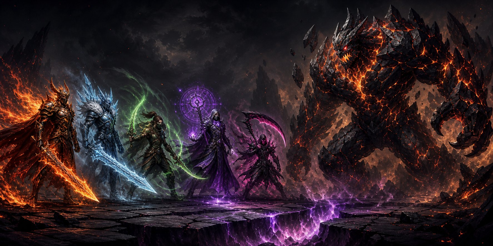
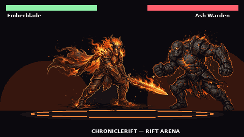

<!-- ChronicleRift README — v0.11.0 -->

<p align="center">
  
</p>

<h1 align="center">⚔️ ChronicleRift</h1>

<p align="center">
  <b>An AI-narrated tactical fantasy adventure that lives inside Telegram.</b><br/>
  Real-time arena duels with your hero's <i>real key art</i>, a colored bot launcher,<br/>
  Rich-Message quest dashboards and a secure Mini App tactical board.
</p>

<p align="center">
  <a href="https://github.com/iamrita-ai/chronicle-rift/actions/workflows/ci.yml"></a>
  <a href="https://www.python.org/"></a>
  <a href="https://core.telegram.org/bots/api"></a>
  <a href="https://github.com/iamrita-ai/chronicle-rift/blob/main/LICENSE"></a>
  <a href="https://github.com/iamrita-ai/chronicle-rift"></a>
  <a href="SECURITY.md"></a>
</p>

<p align="center">
  <a href="https://t.me/TechnicalSerena"></a>
  <a href="https://t.me/XioquiXan"></a>
</p>

---

## ▶️ See it fight

<p align="center">
  
</p>

<p align="center"><i>The duel above is composed from the real in-game fighters.</i><br/>
Want to <b>play</b> it instead of watching? Run the zero-setup local board:<br/>
<code>python tools/preview_miniapp.py</code> → open <b>http://localhost:8080</b> 🎮</p>

---

## ✨ What makes v0.11 special

| | |
|---|---|
| 🎨 **Original fighters** | Hero and monster are rendered from the game's official key art — transparent, pre-decoded, pre-tinted — animated with anticipation, squash-&-stretch, lean, knockback falls and KO topple. No more generic puppets. |
| 🧊 **Immersive 3D arena** | Three.js stage with fog, elemental lighting, GPU particles, dash after-images, blade trails, ward bubbles and a cinematic camera; a full 2D canvas fallback keeps every phone in the fight. |
| 🪨 **Real physics** | Gravity, launches, landing squash + dust rings, ground friction, body push-apart and **arena-wall bounces** with sparks. Momentum matters. |
| ⚡ **Smooth attacks** | Fixed 120 Hz simulation, input buffering, art preloaded & decoded *before* the bell, shaders pre-compiled, pooled effects, shorter hit-stop — taps land instantly. |
| 🎛 **Colored bot launcher** | Every home-screen button is colored (green PLAY, blue screens, red feedback) and deep-links straight into its Mini App screen: Arena, Store, Satchel, Heroes, Profile, Rules, Terms. |
| 📨 **One-tap feedback loop** | 🐛 Bug / ✨ Feature / 💡 Improve buttons deliver your note to the Chronicle **and straight into the owners' private chats**. |
| 👑 **Owner test mode** | `OWNER_USER_IDS` always pass the allow-list and get every hero unlocked plus test coins. |
| 🛍 **Honest shop** | Hero cards show what moves *do* — damage % and effects (burn, freeze, lifesteal, launch…) — instead of cooldown timers. |

---

## 🕹 How to play

You are a **Riftwalker**. One monster guards each chapter; empty its HP bar in a **real-time duel** to advance. Every enemy telegraphs its next move — Guard is a decision, not a coin flip.

| Move | Cost | What it does |
| --- | --- | --- |
| ⚔️ **Strike** | 1 Energy | `4–8 + Level + gear + Focus` damage. A perfect roll (8) is a **CRITICAL ×1.5** that sets **Burning**. |
| 🛡 **Guard** | free, +1 Energy | Ward of `2–5 + gear` subtracted from the incoming hit. Perfect ward **reflects 2**. |
| 🔮 **Scout** | free, +1 Energy | `+1–3 XP` and **exposes** the enemy: next Strike `+2`. |
| 🔥 **Rest** | free, +2 Energy | Recovers `4–7 HP` beside the ember shrine. |

- **Focus combo meter** — Guard/Scout/Rest build +1 (max 3); your next Strike spends all of it for +2/point.
- **Bosses** — every 5th chapter the **Ebon Colossus** arrives with double rewards.
- **Marketplace & Forge** — potions, relics up to Lv 5, and five recruitable elemental heroes.
- **Death is safe** — at 0 HP you wake at camp fully healed and keep everything.

---

## 🤖 The bot home screen

`/start` greets you with the game poster, owner credits and the colored launcher:

```
▶️ PLAY — RIFT ARENA        (green · opens the duel)
🏪 Store   🎒 Satchel       (blue · Mini App screens)
🧙 Heroes  👤 My Profile    (blue / green)
📜 Rules & Regulations  📄 Terms & Conditions
📨 Feedback — 🐛 bug · ✨ feature · 💡 improve   (red · one button, delivered to the owners)
🚀 Deploy Tutorial  👑 Owners & Credits
🧑‍ Source · Contribute  🔗 Share Mini App   (shareable t.me link)
```

Commands: `/play` `/status` `/shop` `/bag` `/rules` `/about` `/help` `/app`.

---

## 🚀 Deploy it yourself

### 🏠 Local — play in 30 seconds (no accounts)

```bash
git clone https://github.com/iamrita-ai/chronicle-rift
cd chronicle-rift
pip install -e ".[dev]"
python tools/preview_miniapp.py        # → http://localhost:8080
```

### 🖥 Any VPS (DigitalOcean · Hetzner · AWS · Oracle free tier)

```bash
# 1. Ubuntu 22.04+, port 443 open, domain pointed at the box
git clone https://github.com/iamrita-ai/chronicle-rift && cd chronicle-rift
cp .env.example .env                   # fill BOT_TOKEN, MONGODB_URI, GROQ_API_KEY

# 2a. Docker (easiest)
docker build -t chronicle-rift .
docker run -d --env-file .env -p 8000:8000 --name chronicle-rift chronicle-rift

# 2b. …or systemd + venv
python -m venv .venv && .venv/bin/pip install -e .
# unit runs:  .venv/bin/python -m chronicle_rift   (BOT_MODE=webhook)

# 3. Caddy/Nginx + TLS in front, then:
#    PUBLIC_BASE_URL=https://your.domain  in .env
# 4. @BotFather → Bot Settings → Menu Button → https://your.domain/app
```

### ☁️ Render (zero-ops)

Import the repo on [render.com](https://render.com) — `render.yaml` wires the web
service. Add `BOT_TOKEN`, `MONGODB_URI`, `GROQ_API_KEY` as secrets; Render supplies
`RENDER_EXTERNAL_URL` automatically.

> Full variable reference lives in `.env.example`. Owners should also set
> `OWNER_USER_IDS=<your tg id>` to unlock everything and receive feedback.

---

## 👑 Owners & credits

| Role | Telegram | |
|---|---|---|
| 👑 **Owner** | [@TechnicalSerena](https://t.me/TechnicalSerena) |  |
| 🛠 **Co-owner** | [@XioquiXan](https://t.me/XioquiXan) |  |

Built with 💙 for the rift. Every feedback note is read before each new build.

---

## 🔐 Security

- All game rules resolve **server-side**; the Mini App never sends user IDs or state —
  every request is authenticated with verified Telegram `initData` (HMAC + age check).
- Webhooks are protected by a secret derived per-bot; payloads are size-capped.
- See **[SECURITY.md](SECURITY.md)** for the responsible-disclosure process —
  or message [@TechnicalSerena](https://t.me/TechnicalSerena) directly on Telegram.

## 🤝 Contributing

Issues and pull requests are welcome on
[github.com/iamrita-ai/chronicle-rift](https://github.com/iamrita-ai/chronicle-rift).
Run `ruff check .` and `pytest` before pushing; keep the arena smooth on low-end
phones (that is the project's soul).

## ⚖️ License

[MIT](LICENSE) — play it, fork it, learn from it.

---

<p align="center">
  <a href="https://github.com/iamrita-ai/chronicle-rift">⭐ Star the repo</a> ·
  <a href="https://t.me/share/url?url=https%3A%2F%2Fgithub.com%2Fiamrita-ai%2Fchronicle-rift&text=ChronicleRift%20%E2%80%94%20a%20tactical%20RPG%20inside%20Telegram!">🔗 Share the game</a> ·
  <a href="docs/gameplay.gif">🎬 Watch the duel</a>
</p>
